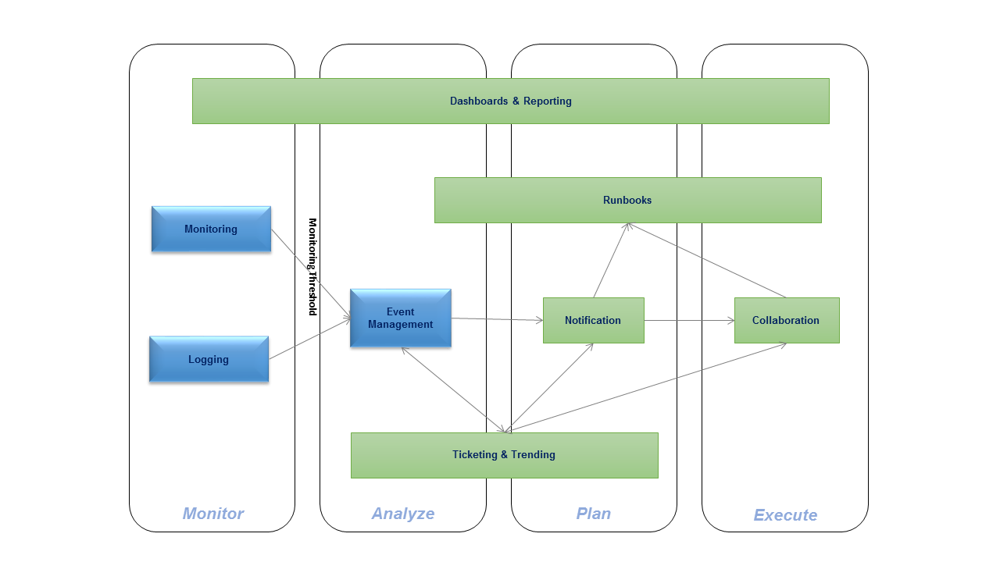

## IBM Cloud Service Management and Operations
# Monitoring in IBM Cloud Private
Here you will will find artifacts created by the IBM CSMO team to assist you with performance management
of your ICP deployment.
You will find hints and tips, integration how tos, Grafana Dashboards and more!

As defined in the [Cloud Service Management and Operations reference architecture](https://www.ibm.com/cloud/garage/content/architecture/serviceManagementArchitecture), the monitoring & logging components of the CSMO toolchain "kick off" the incident management process.

As of late October, we are concentrating only on the Monitoring & Logging components which are builtin to the Kubernetes component of IBM Cloud Private. We will also discuss integration points with external Event Management solutions such as Netcool Operations Insight.

Soon, this document will be updated to include internal monitoring components such as Cloud Foundry monitoring capabilities and external components such as [APM](./APM).
