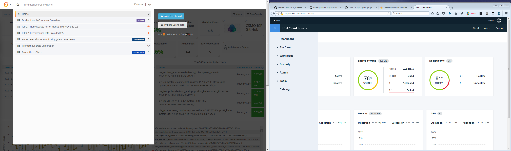
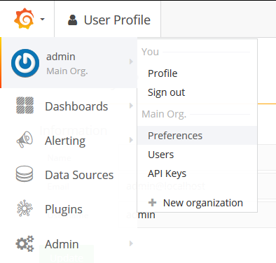
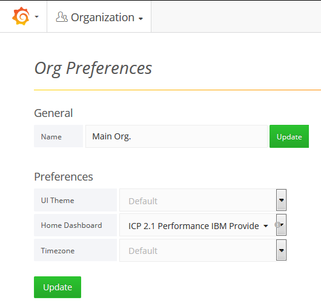

## How to import the CSMO Grafana Dashboads
 1) Download and unpack the json files on your computer. 
 2) In the file **ICP 2.1 Performance IBM Provided.json**, find and correct the link to Kibana (`https://<icp_IP_address>:8443/kibana`) or Import the dashboard and follow these instructions for customizing the Link to Kibana from within the dashboard: [Kibana_Link](Edit_Kibana_Link.md)
 3) Launch the ICP Grafana (https://<your.deployment.ipaddress>:8443/grafana)
 4) Click on **Home** on the top left, a drop down menu will appear.
 5) On the right of this menu clink on **Import Dashboard** 
 6) Click on **Upload** json file
 7) Navigate to the directory where you unpacked the Dashboard json files and select the Dashboard to import
 8) You will need to specify the "prometheus" data source 
 9) Click **Upload**
 10) The dashboard is now available

 + Note: Repeat this procedure for each dashboard

## How to import the Prometheus Data Exploration dashboard
  1) In the **Import Dashboard** menu, enter the value 456 into the **Grafana.com Dashboard** field.
  2) You will need to specify the "prometheus" data source
  3) Click **Import**
  4) The dashboard is now available

 + Note : You can find more dashboards at https://grafana.com/dashboards?dataSource=prometheus
 
## How to set a default dashboard
You can make a dashboard the default dashboard you see whn you login to Grafana by marking the star next to it in the dashboard drop down menu and then choosing it as the default in the organization profile.

