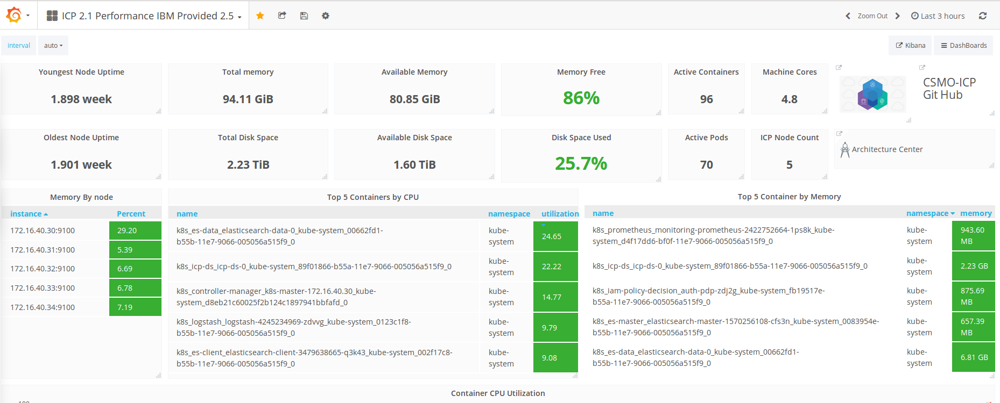

## IBM Cloud Service Management and Operations
### Performance Management in IBM Cloud Private

 
```
Bug fix for Namespace Dashboard

In the last relaease of ICP the Namespace variable was somehow corrupted. The Namespace selector will be 
blank, the default is not populated. We have corrected this and a working NameSpace dashboard is available 
for import from this repo. Or you can fix it locally in ICP by changing the namesspace in the menu and 
refreshing your browser. The dashboards installed with ICP are read-only. You will need to save them 
to perform your own customizations.

Open an issue if you have any questions. 

The Dashboards are now named ICP 2.1.0.2* to reflect the current ICP version. They are not dependent 
on the ICP version. 

Thanks, Your friendly neighborhood CSMO Team. 
````

We have created a ICP Specific Dashboards for your use. These dashboards are focused on the performance of the ICP deployment and the name spaces
As with any other Grafana import you will need to specify the Prometheus data source. The default prometheus Grafana data source  was used to create these dashboards.

* Note: It is assumed that you have a working knowledge of Grafana and capable of editing a configuration in the dashboard.

#### The dashboards can be downloaded via the following links: 


                                      DO NOT USE right-click Save As to save these dashboards. 
         
This link is a compressed file of the CSMO dashboards. Click on this link and Download from the git repo by clicking the download button. 

[csmodashboards.zip](https://github.com/ibm-cloud-architecture/CSMO-ICP/blob/master/grafana/csmodashboards/csmodashboards.zip) 

Unzip and import the json file into Grafana. 
 OR 
Click on each link below and copy the json into the Grafana import json window. 
 
[ICP 2.1.0.2 Performance Dashboard](https://github.com/ibm-cloud-architecture/CSMO-ICP/blob/master/grafana/csmodashboards/ICP%202.1.0.2%20Performance%20IBM%20Provided%202.5-1522946498049.json)

[ICP 2.1.0.2 Namespace Performance](https://github.com/ibm-cloud-architecture/CSMO-ICP/blob/master/grafana/csmodashboards/ICP%202.1.0.2%20Namespaces%20Performance%202.5%20IBM%20Provided-1522946328109.json)

#### ICP 2.1.0.2 Peformance IBM Provided Dashboard
##### Current Version 2.5
This dashboard provides a summary of current performance of the ICP environment. One should be able to immediately see what components are the top 5 consumers of CPU and Memory.  When importing this dashboard, you will need to change the "dummy" Kibana link to work in your installation. [Instructions are here](https://github.com/ibm-cloud-architecture/CSMO-ICP/blob/master/grafana/Edit_Kibana_Link.md)

Detailed Dashboard Information [ICP_Peformance](ICP_Performance_Dashboard_Detail.md)



####  ICP 2.1.0.2 Namespace Performance IBM Provided Dashboard
##### Current Version 2.5
This dashboard provides a focus on the namespace memory and CPU performance in your deployment. Just download and import the json file and you are good to go
You can switch between namespaces by changing to the desired namespace at the top of the dashboard. You can only view one namespace at a time.


