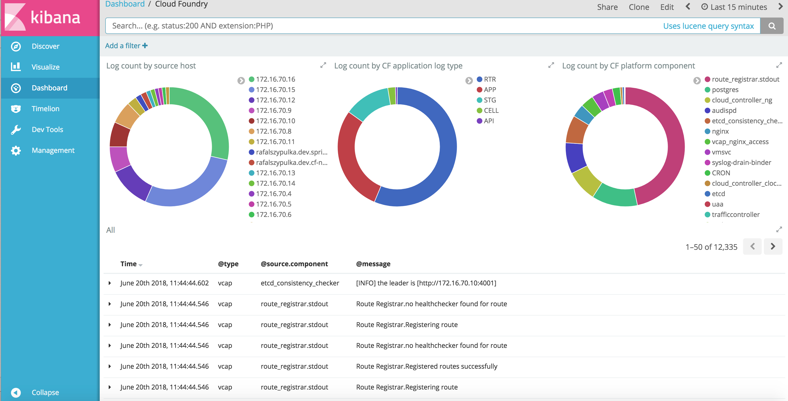
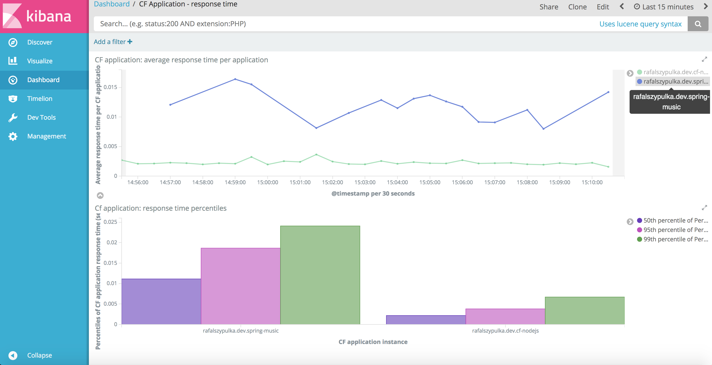
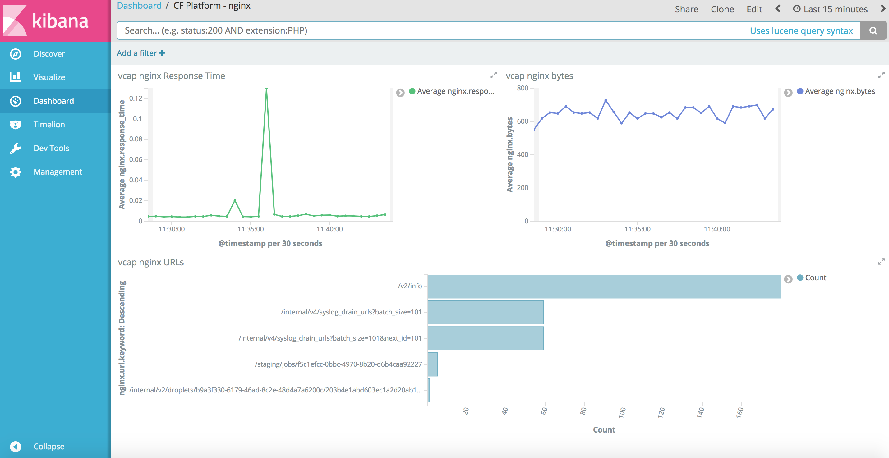

# CSMO logging solution for ICP Cloud Foundry

ICP ELK configuration for ICP Cloud Foundry platform and application logs.

## Configure external access to ICP Logstash
Create k8s service of type `NodePort` in order to provide an external access to ICP ELK logstash service. In the following example we assume that logstash tcp input listens on TCP port `5000`, externaly exposed on port `30384`.

```
apiVersion: v1
kind: Service
metadata:
  name: cflogs
  namespace: kube-system
spec:
  ports:
  - name: cf
    nodePort: 30384
    port: 5000
    protocol: TCP
    targetPort: 5000
  selector:
    app: logging-elk-elasticsearch
    component: logstash
    role: logstash
  type: NodePort
```
Create `cflogs` service using command:

```
kubectl create -f cflogs.yml
```

## Import logstash config for Cloud Foundry
Merge provided logstash [configuration](cflogs.conf) with your existing ICP ELK logstash configuration.

If there are no modifications in the default `logging-elk-logstash` ConfigMap (ICP 2.1.0.3), then you can just replace it with the provided ConfigMap [logging-elk-logstash-config-cf](logging-elk-logstash-config-cf.yml). Don't forget to backup your existing `logging-elk-logstash` ConfigMap!

```
kubectl replace --force -f logging-elk-logstash-config-cf.yml
``` 

## Configure ICP CloudFoundry to forward logs to ICP ELK

**Prerequisite:** Cloud Foundry up and running (ICP Cloud Foundry deployment [instructions](https://github.com/ibm-cloud-architecture/refarch-privatecloud/blob/master/InstallCloudFoundryOnPrem.md)).


### Cloud Foundry platform logs
To configure ICP CF to forward system logs to your newly created `cflogs` service, add the following to the bottom of your CloudFoundry uiconfig.yml file:

```
cf_custom: |
  properties:
    syslog_daemon_config:
      address: <logstash-ip>
      port: <logstash-port>
      transport: tcp
```


Execute the following commands to apply CF config change:

```
cd /opt/cf
./cm engine reset
./launch_deployment.sh -c uiconfig.yml --no-validation |tee logstash.log
```


This will redeploy CF and configure logging. Importantly, if you change the exposed port to the logstash service you will need to reconfigure this file and redeploy.

### Cloud Foundry application logs

To configure an application to send logs to the k8s based ELK stack use the following commands:

```
cf cups elk-log-drain -l syslog://<logstash-ip>:<logstash-port>
cf bind-service <appname> elk-log-drain
cf restage <appname>
```

where `<logstash-port>` is the external NodePort configured for the `cflogs` service (for example: `30384`).


## Import provided Kibana objects
Before importing Kibana objects (preefined searches, vizualizations and dashboards), make sure that `logstash-*` index has all the required fields.

Index fields are created dynamically when documents including these fields arrive for the first time to elasticsearch. Make sure that CloudFoundry platform log streaming is already configured and logs are sent to elasticsearch. Deploy also at least one CF application and genetate some web application requests, so CF application logs are generated and sent to elasticsearch. Verify that CF application log entries are available in Kibana search results and refresh field list in the index pattern `Management -> Index Patterns -> Refresh`

Alternative way to define required index field is to import the index template.

1). Import provided CSMO ICP CF logging solution index template - [icp-cf-mapping.json] (icp-cf-mapping.json):

```
curl -XPUT -H 'Content-Type: application/json' http://localhost:9200/_template/csmo_cloudfoundry -d@icp-cf-mapping.json
```

2). Delete the current logstash index and wait a couple of seconds for a new log records, so index will be recreated.

3). Refresh field list in the Kibana index pattern. After refresh it should list all required fields.

### Import Kibana objects

Open ICP ELK Kibana dashboard `https://<ICP_portal>:8443/kibana` and select `Management -> Saved objects -> Import` then select provided [cf-kibana.json](cf-kibana.json) file.

## Example dashboards

1). General Cloud Foundry dashboard with counts of logs per source host, CF application [log type](https://docs.cloudfoundry.org/devguide/deploy-apps/streaming-logs.html) and CF platform component type.



2). Cloud Foundry application response time dashboard based on data from CF Router logs. Line chart shows response time per CF application. Bar chart shows 50th, 95th and 99th percentiles of the response time per CF application in the selected time range.



3). Cloud Foundry platform dashboard for Nginx component. Shows average response time, bytes sent and top URLs in terms of number of requests.



More screenshots [here](kibana-objects).