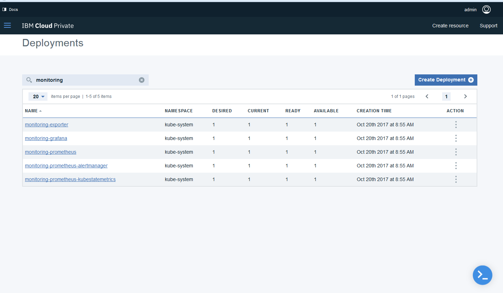

**Prometheus**

***Base documentation for Prometheus Monitoring***

[Basic documentation can be found in the ICP Knowledge center](https://www.ibm.com/support/knowledgecenter/SSBS6K_2.1.0/manage_metrics/monitoring_service.html)

***Further information***

Prometheus is a systems and service monitoring system. It collects metrics from configured targets at given intervals, evaluates rule expressions, displays the results, and can trigger alerts if some condition is observed to be true. 
https://prometheus.io/
Both Prometheus and Kubernetes are developed under the Cloud Native Computing Foundation (CNCF) project.

Prometheus has several components for the collection of Time Series Data, an Alert Manager and a central Prometheus Server which scrapes  and stores the data. The data is visualized using a Grafana instance.


The Prometheus and Grafana stacks are deployed by default when ICP is installed, unless the value of **disabled_management_services** is changed from default in [config.yaml](https://www.ibm.com/support/knowledgecenter/SSBS6K_2.1.0/installing/config_yaml.html)
If you've configured ICP to use a [management node](https://www.ibm.com/support/knowledgecenter/SSBS6K_2.1.0/installing/hosts.html) then the stack will be deployed on that node. Otherwise they will co-exist with the rest of the workloads.

Within the ICP GUI, you can see the Prometheus/Grafana Deployments, Services and ConfigMaps using the **main menu**->**Platform** and then choose the component you are interested in.
Filter by *monitoring* and *alert* to see the components.


You can also see the components using the command line interface:

```
$kubectl get configmap --namespace=kube-system | grep "alert\|monitor"
alert-rules                           1         6d
alertmanager-router-nginx-config      1         6d
monitoring-grafana-config             1         6d
monitoring-grafana-dashboard-config   3         6d
monitoring-prometheus                 1         6d
monitoring-prometheus-alertmanager    1         6d
monitoring-router-entry-config        1         6d
```


